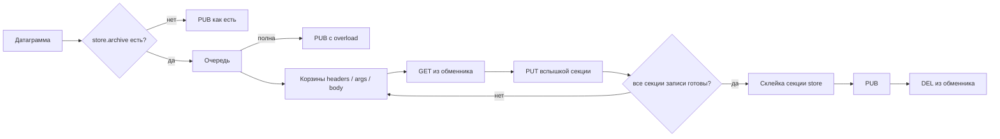

# Агент ноды

Sidecar на хосте nginx. Забирает поколение у контроллера, собирает дерево конфига, делает
`nginx -t` и `reload`, пишет своё присутствие в `WAF_STATUS`. Модуль в этом контуре не участвует:
он не ходит в store и не сигналит мастеру.

Спецификация раскатки — `docs/config-distribution.md`. Этот
документ — перечень функций самого процесса. В коде — пульс присутствия,
приём итога с unix-сокета, публикатор `kind=request` в `WAF_AUDIT`, архивация
удержанных модулем объектов из обменника в S3 и приём строк лога nginx со второго
сокета в `WAF_LOG`.

## Язык

**Go**, как у боевых инспекторов и прочих сайдкаров рядом с nginx
(`docs/nginx/module/README.md`). Нужны клиент NATS/JetStream, HTTP к контроллеру,
криптография конверта и `exec` `nginx -t` / `nginx -s reload` — не цикл событий nginx и не shm.

## Размещение

Отдельный процесс на той же ноде, что и nginx. Не в воркере, не в том же бинаре модуля.

В Kubernetes — второй контейнер в поде (общий volume дерева конфига, возможность послать сигнал
мастеру). В deploy/ (`deploy`) — соседний сервис compose, не процесс внутри образа модуля.

Один агент на одну ноду. Два агента на одном дереве конфига — гонка `reload`.

Управление конфигурацией — роль, а не данность. `nginx { manage off }` (или
`WAF_NGINX_MANAGE=off`) оставляет агенту аудит, архив и пульс, но снимает с него поколение:
так стоят сайдкары рядом с нодами, чей конфиг лежит файлом, и рядом с хранилищами. Без этого
такая нода репортила бы `apply_failed` вечно — `nginx -t` требует того же бинаря с модулем,
которого у сайдкара нет. Управляемая нода стенда — `edge-managed` в
deploy/docker-compose.yml (`deploy/docker-compose.yml`).

## Что делает

### 1. Идентичность

Знает, кто он. `WAF_NODE_ID` совпадает с `waf_node_id` в шаблоне nginx — иначе инбоксы воркеров и
карточка флота разъедутся. Собственный uuid агента стабилен между рестартами (файл в каталоге
данных), его контроллер кладёт в Redux как ключ записи `kind=agent`.

Ключ контура — `WAF_NODE_KEY` или файл Secret. На контроллер не попадает. Один ключ на контур:
новая нода монтирует тот же Secret.

### 2. Watch desired

Смотрит JetStream KV `WAF_DESIRED/policy/nginx`. Сохранить черновик в контроллере ≠ событие для
агента. Событие — `send`: манифест с `rev`, `config_hash`, текстом шаблона (или ссылкой, если не
влез в KV) и списком `store:<uuid>`.

Пока KV нет или манифеста нет — агент жив, apply не делает, heartbeat без нового hash.

### 3. Сверка шаблона

Считает SHA-256 поля `config` **как пришло**, до подстановки путей. Это значение уходит в
heartbeat и сверяется с `config_hash` манифеста. Расхождение — отказ, боевое дерево не трогать.

Собирает UUID из токенов `store:<uuid>` в тексте и сверяет со списком манифеста. Лишний или
недостающий uuid — отказ.

### 4. Store

Забирает ciphertext `GET /api/<scope_uuid>/store/<uuid>/blob`. Форма URI —
`docs/requirements.md`: пространство в пути, не в query.

Открывает конверт ключом контура. Провал — статус `undecryptable`, heartbeat со **старым** hash,
боевые файлы не переписывать. Подмена blob без ключа даёт ошибку decrypt, не чужой PEM.

Повторно качать неизменный uuid не обязательно: объект в базе не обновляется, замена — новый UUID.

### 5. Дерево конфига

Собирает новое дерево рядом с боевым, не поверх него.

- Шаблон: каждый `store:<uuid>` → абсолютный путь, например
  `/var/lib/waf/store/live/<uuid>`; `pages:` → каталог страниц ноды. Литерал секрета в
  `nginx.conf` не подставляется.
- Файлы store: plaintext, режим `0600`.
- Страницы отказа: режим `0644` — их читает воркер и отдаёт клиенту, прятать нечего.
  Каталог заменяется целиком, поэтому убранная из пространства страница исчезает и с ноды.
- Мастер nginx видит обычные пути. Если токен пропустить, `-t` упадёт на несуществующем пути —
  это отказ, не «unknown variable».

`waf_node_id` в шаблоне агент не выдумывает: либо он уже в тексте с контроллера, либо это
плейсхолдер, который агент заполняет своим `WAF_NODE_ID` до `-t`. Склеивать инбоксы двух нод
одним именем нельзя.

### 6. `nginx -t`

Прогон на **новом** дереве. Провал — боевое дерево не трогать, статус `apply_failed`, heartbeat
со старым hash. Трафик не затронут.

Агент не парсит `error.log` модуля и не считает вердикты. `-t` либо прошёл, либо нет.

### 7. Apply

Успешный `-t`: атомарная подмена include / дерева и `nginx -s reload`.

Поведение reload для модуля агент не дублирует: старые и новые воркеры сосуществуют, инбокс с
nonce, дренаж вердиктов — `docs/deployment.md`.

Размер `waf_shm_zone` reload не меняет. Если поколение требует полного restart, агент не врёт
статусом `migrated` после `-s reload`: отдельный исход `restart_required`, мастер не убивать из
агента без явной политики.

Откат — `send` предыдущего шаблона. UUID на месте, файлы store перекачивать не нужно, если они
ещё на диске.

### 8. Присутствие

Пишет last-per-subject с TTL:

```text
WAF_STATUS.node.<node_id>.agent
```

Это не heartbeat поколения и не метрики модуля. Поколение — группа живых воркеров с одним
`config_hash`; его публикует модуль на `WAF_STATUS.node.<node_id>.worker.<pid>.<nonce>`. Агент
pid/nonce воркеров не знает и `/proc` не читает.

Воркер ставит отпечаток боевого `nginx.conf` (`md5:…`), поэтому агент кладёт в свой кадр тот же
отпечаток отдельным полем `conf_fingerprint` — байты, которые он сам записал на шаге 7, плюс
затравка с диска на старте. С ним и сравнивают воркеров. Поле `config_hash` для этого не годится:
там `sha256` пака, то есть шаблон до подстановки путей ноды, и с md5 файла оно не сойдётся
никогда — сравнение с ним показывало бы «отстал» на исправном флоте.

Старая строка в spec `WAF_STATUS / node/<id>/<nonce>` как heartbeat поколения для агента
не используется.

Кадр агента. `host` — машина (в контейнере — cgroup), не воркеры nginx.

```json
{
  "v": 1,
  "kind": "agent",
  "id": "3f2a9c1e-4b2a-41c0-8f3a-000000000001",
  "node_id": "edge-07",
  "hostname": "edge-07",
  "config_hash": "sha256:8f3c…",
  "conf_fingerprint": "md5:a036c6f4…",
  "rev": 43,
  "apply": "ok",
  "at": "2026-08-13T21:00:00Z",
  "rps": 142.3,
  "codes": {
    "2xx": 130.1,
    "3xx": 2.0,
    "4xx": 10.2,
    "5xx": 0
  },
  "routes": [
    { "server": "shop.example.com", "location": "/api/",
      "rps": 120.1, "codes": { "2xx": 110.0, "3xx": 0, "4xx": 10.1, "5xx": 0 } },
    { "server": "shop.example.com", "location": "/",
      "rps": 22.2, "codes": { "2xx": 20.1, "3xx": 2.0, "4xx": 0.1, "5xx": 0 } }
  ],
  "host": {
    "cpu": {
      "cores": 8,
      "usage": 0.23,
      "load1": 0.41,
      "load5": 0.38,
      "load15": 0.35
    },
    "memory": {
      "total": 16777216000,
      "used": 4294967296,
      "available": 12482248704
    },
    "uptime_s": 86400
  }
}
```

`cpu.usage` — доля 0..1 с прошлого пульса; первый кадр может быть нулевым. `load*` — средняя
нагрузка ОС, на Windows может быть нулями. Память — байты.

`rps` — скользящее окно 10 с по итогам с `waf_agent_socket`: число запросов / 10.
`codes` — те же корзины по классу ответа. На `allow` фазы запроса модуль шлёт
`status=0` (апстрим ещё не ответил) — тогда 2xx из вердикта, redirect→3xx,
deny→4xx. Нет трафика — нули. Считает агент, не модуль.

Запросов, а не решений: в счётчик идёт только фаза запроса. Фаза ответа пишет
вторую запись на тот же `ray`, а кадровый трафик — по записи на кадр, и без
этого правила метр считал бы записи аудита, а не запросы.

`routes` — тот же темп по маршрутам конфигурации: `server` — имя блока
`server {}` (`_` у перехватчика по умолчанию), `location` — имя блока пути
(`/`, если блока нет). Сумма строк равна `rps`, сумма классов — `codes`.
Молчащий маршрут из списка уходит, потолок — 512 маршрутов на ноду. Секция
необязательна: без трафика её нет. Подробности —
`docs/messages/fleet-pulse.md`.

`apply`: `ok`, `apply_failed`, `undecryptable`, `restart_required`. Нет манифеста — кадр всё равно
идёт, `config_hash` / `rev` / `apply` опускаются. Сейчас агент так и шлёт: только id, нода,
hostname и `host`.

TTL и период пульса — секунды: контроллер ставит `degraded` после 15 с тишины и выкидывает запись
после 60 с. По умолчанию агент пишет каждые 4 с (`WAF_HEARTBEAT_EVERY`).

Контроллер не опрашивает nginx. Он слушает шину и кладёт кадр в секцию `fleet.agents`. Demo-пульсы
воркеров (`CONTROLLER_FLEET_DEMO`) — только вне `deploy/`: там три живых агента.

### 9. Аудит решения

Слушает unix-сокет (`WAF_VERDICT_SOCK`, по умолчанию `/var/run/waf/verdict.sock`).
Модуль кладёт туда готовую запись аудита одним `sendto` и не ждёт. Агент
дописывает `v` и `kind` и публикует её на `waf.audit.request.<node_id>` **как
есть**. Схема — docs/messages/agent.schema.ts (`docs/messages/agent.schema.ts`),
разбор — `docs/messages/module-agent.md`.

```json
{
  "v": 1,
  "kind": "request",
  "ray": "11d4ea9c-80b2-4c7e-9f01-6a5b4c3d2e10",
  "node": "edge-01",
  "phase": "request",
  "ts": "2026-08-15T21:42:31.660Z",
  "client_ip": "203.0.113.77",
  "http": { "method": "POST", "scheme": "https", "host": "shop.example.com",
            "uri": "/api/orders", "version": "HTTP/1.1", "status": 403 },
  "route": { "server_name": "shop.example.com", "location": "/api/" },
  "verdict": "deny",
  "code": "score",
  "by": "module",
  "score": { "total": 80, "deny_at": 50 },
  "inspectors": {
    "module": { "verdict": "deny" },
    "modsec": { "verdict": "score", "score": 80, "latency_ms": 4 }
  },
  "waf_latency_us": 9100
}
```

Что сделали — `verdict` (`allow` | `deny` | `redirect`), почему — `code`
(нет ровно на `allow`), кто — `by`, ключ в карте `inspectors`.

Агент вердикт не считает и запрос не видит. Разбирать сообщение в структуру он
тоже не пытается: так теряется всё, чего в структуре не оказалось, а схема
начинает жить в двух местах. Промах сокета или мёртвый агент: аудит пропал,
запрос не ждёт.

### 10. Архивация

Единственное, что агент в записи меняет, — секция `store`, и только когда модуль
об этом попросил. Просьба выглядит как `store.archive`: карта «вид объекта →
условия записи» для тех объектов, которые модуль **не удалил** из обменника. Условия
— это `ttl` в секундах (ноль означает «хранить вечно») и необязательный `limit`,
предел записи в байтах. С этого момента ключи принадлежат агенту.



Порядок двух последних шагов принципиален. Падение между ними оставляет верную
запись и осиротевший ключ, который доберёт `retain_ttl`. В обратном порядке
теряется запись, а объект остаётся в архиве без единой ссылки на себя — то есть
навсегда и невидимо.

Работа уходит в ограниченную очередь с пулом воркеров, потому что `handoff.Serve`
вызывает обработчик синхронно в цикле чтения датаграмм, а у `unixgram` нет
обратного давления: задержка здесь — это переполненный буфер сокета и потерянные
записи там. Быстрый путь (`archive` на проводе нет) стоит ровно столько же,
сколько стоил до появления архива.

Переполнение очереди запись аудита не теряет: она публикуется немедленно, с
локаторами `unavailable: "overload"`. Теряется полезная нагрузка, не событие.
Своя причина у переполнения потому, что лечится оно ёмкостью очереди и числом
воркеров, а `archive_error` — хранилищем или развёрткой: смешивать их в логе
значит смешивать два разных дежурства. Остальные причины: `archive_error` —
`PUT` не удался или бакет для этого вида не настроен, `expired` — ключа в обменнике
уже не было, `empty` — объект требовался и оказался пуст.

Ключ объекта — `<yyyy>/<mm>/<dd>/<node>/<ray>[.<фаза>].<hdr|arg|body>` (у фазы запроса сегмента фазы нет, у ответа — `.response`: ray у них общий), тег в том же
`PUT` — `waf-retain-ttl=<секунды>`. Срок агент не толкует: переносит в тег, а
удаляет объект lifecycle-правило бакета, настроенное на этот тег. В ключе срока
нет намеренно — иначе одна и та же величина жила бы в двух местах и рано или
поздно разошлась. Раскладка по трём бакетам и правила —
`docs/deployment.md`.

`limit` режет объект перед `PUT`, и архивный локатор уезжает с `truncated: true`.
Режет агент, а не модуль: в обменнике объект лежит целиком, потому что его мог
попросить инспектор, и отдать инспектору меньше просимого ради настройки архива
модуль не вправе. Пустой объект в архив не пишется вовсе — пустышка в бакете
неотличима от объекта, которого не было.

При включённом `waf_body_encrypt` агент копирует шифротекст: ключа он не видит и
видеть не должен, блок `enc` просто переезжает в новый локатор.

Клиенты обменнику и архиву написаны здесь же, поверх стандартной библиотеки: RESP —
это две команды, а SigV4 — пять HMAC, тогда как SDK принесли бы разрешение
регионов, свои ретраи и полсотни транзитивных модулей ради одного `PutObject`.

### 11. Логи nginx

Второй unix-сокет ноды (`log_sock`, по умолчанию `/var/run/waf/log.sock`).
Кладёт туда строки не модуль, а сам nginx своим syslog-писателем:

```nginx
access_log  syslog:server=unix:/var/run/waf/log.sock,tag=nginx,nohostname;
error_log   syslog:server=unix:/var/run/waf/log.sock,tag=nginx,nohostname warn;
```

Агент снимает шапку RFC 3164 — уровень из приоритета, сервис из тега — и
публикует строки пачками на `waf.log.<node_id>`. Пачками, а не по одной:
access-лог на тысяче запросов в секунду — это тысяча публикаций с ноды по
двести байт полезного. Границы пачки: 500 строк, 256 КБ или 200 мс, что раньше.

Время строки ставит агент в момент приёма. Своей отметки у строки нет: в
шапке syslog ни года, ни зоны, ни долей секунды, а собственное время nginx
остаётся внутри текста.

Отказ этого сокета ноду не валит: без сокета вердиктов агент бесполезен, а без
этого он по-прежнему ведёт аудит, архив и пульс. `log_sock off` (или пустой
`WAF_LOG_SOCK`) выключает приёмник совсем — на ноде, где логи собирает кто-то
другой, лишний сокет только путает; тогда и канала `log` в секции `io` кадра
присутствия нет.

Дорога целиком, включая таблицу и раздел UX, —
`docs/logger/logs.md`.

## Чего не делает

| Не его | Кто |
| --- | --- |
| Вердикты, волны, инбокс `_INBOX.waf.…` | модуль |
| Формат строки лога и её уровень | nginx: `log_format`, `error_log <level>` |
| Presence воркера (`pid`, `nonce`, inflight) | модуль |
| Метрики Prometheus (`waf_status`) | модуль, этап 13 |
| Снапшоты `waf_local_dataset` | поставщик → JetStream → shm |
| Правила инспекторов / CRS | CRS — образ; локальные профили — KV, сам инспектор |
| Бинарь модуля | пакет / образ nginx |
| Шифрование PEM в браузере | UX оператора |
| `send`, черновик, каталоги в Postgres | контроллер |
| Инвентарь «нода должна существовать» | позже Postgres; агент только факт |

Горячий путь при мёртвом агенте не останавливается: уже применённое дерево работает, итог
на сокете дропается. Встают только новый `send`, смена секретов и запись в `WAF_AUDIT`.

## Конфиг

Файл — [agent.conf](../../agent/agent.conf), путь задаёт `WAF_AGENT_CONFIG`
(на стенде `/etc/waf/agent.conf`). Блоки: `node`, `nats`, `redis`, `s3`, `archive`,
`nginx`, `controller`. Незнакомый ключ — ошибка на старте, не молчаливый пропуск.

В блоке `redis` два адреса на две роли: `url` — обменник, откуда архив забирает объекты запроса
после вердикта; `internal` — внутренний Redis контура, где контроллер держит блобы поколения
(`waf.blob.<sha256>`), и откуда их читает `desired watch`. Пустой `internal` — блобы ищутся в
обменнике, как до разделения (см. docs/deploy/README.md#redis). Та же форма блока — в
`inspector.conf` у инспекторов; точку с запятой в конце ключа агент принимает.

Блобы живут в Redis со сроком 300 с, продлевает его контроллер. Нода, проснувшаяся после того,
как срок вышел, получает `desired fetch failed` с `retry_in` и повторяет забор раз в 30 с, пока
контроллер не вернёт тела или не приедет новый указатель; на старом дереве она при этом работает,
в пульсе — `apply_failed`. Провал `nginx -t` или расшифровки не повторяется: он детерминирован.

Окружение перекрывает файл: три ноды монтируют один `agent.conf`, а `WAF_NODE_ID`
у каждой свой. Реквизиты S3 файл только называет (`s3.credentials`) — сами ключи
в секрете.

Архив копит три независимые корзины (`archive.batch`): вспышка по `size=` или
`timeout=`. Секции не ждут друг друга. Запись аудита публикуется, когда уедут
все её секции. `off` — сразу, один `PutObject` на объект: у S3 пакетной записи нет.

Без файла окружение по-прежнему достаточно.

## Окружение

| Переменная | Смысл |
| --- | --- |
| `WAF_AGENT_CONFIG` | Путь к `agent.conf`; если задан и файл не читается — ошибка |
| `WAF_NODE_ID` | Имя ноды, то же, что `waf_node_id` |
| `WAF_NODE_KEY` | Приватный ключ контура (или путь к файлу) |
| `WAF_NATS_URL` | Шина: KV desired и `WAF_STATUS` |
| `WAF_CONTROLLER_URL` | База URI контроллера, без хвоста `/api/…` |
| `WAF_SCOPE` | UUID пространства в пути store |
| `WAF_NGINX_BIN` | `nginx`, по умолчанию в `PATH` |
| `WAF_NGINX_CONF` | Боевой `-c`, который видит мастер |
| `WAF_DATA_DIR` | Дерево store, staging, uuid агента |
| `WAF_HEARTBEAT_EVERY` | Период пульса, по умолчанию `4s` |
| `WAF_VERDICT_SOCK` | Unix dgram от модуля, по умолчанию `/var/run/waf/verdict.sock` |
| `WAF_LOG_SOCK` | Unix dgram от nginx: строки лога, по умолчанию `/var/run/waf/log.sock`. Пустое значение выключает приёмник |
| `WAF_AGENT_LOG` | Стартовый уровень своего журнала агента (`service=agent` в waf.log, `writer` — имя ноды): словарь `error_log` nginx без `emerg`; живьём — «Журналы → Уровни журнала» (`docs/logger/logs.md`) |
| `WAF_LOG_SHIP` | `off` — свой журнал агента только в stdout. Строки nginx из сокета это не трогает: у них свой выключатель, `WAF_LOG_SOCK` |
| `WAF_NGINX_DEBUG` | Только у управляемой ноды (`nginx/managed/entrypoint.sh`): `on` поднимает мастер из `nginx-debug` и отдаёт агенту тот же бинарь через `WAF_NGINX_BIN` — отладка ядра nginx, стартовым флагом |

Архивация настраивается отдельным набором. Ничего не задано — архивация выключена, и это не ошибка:
модуль может её и не просить. Задано криво — ошибка на старте, потому что тихо деградировать в
«архива нет» значит однажды обнаружить пустой бакет вместо доказательной базы.

| Переменная | Смысл |
| --- | --- |
| `WAF_RETAIN_S3_ENDPOINT` | Архив: `https://host[:port]`, адресация path-style |
| `WAF_RETAIN_S3_REGION` | Регион подписи, по умолчанию `us-east-1` |
| `WAF_RETAIN_S3_CREDENTIALS_FILE` | Файл с `aws_access_key_id` и `aws_secret_access_key`. Файл, а не переменные: окружение видно соседям по машине и уезжает в дампы |
| `WAF_RETAIN_BUCKET_HEADERS` | Бакет для заголовков. Пусто — этот вид не архивируется, объект уедет как `archive_error` |
| `WAF_RETAIN_BUCKET_ARGS` | То же для строки запроса |
| `WAF_RETAIN_BUCKET_BODY` | То же для тела |
| `WAF_REDIS_URL` | Обменник (`redis.url` в файле): его же берёт архив, пока `WAF_RETAIN_REDIS_URL` не задан |
| `WAF_REDIS_INTERNAL_URL` | Внутренний Redis контура (`redis.internal`): блобы поколения для `desired watch`. Пусто — блобы в обменнике |
| `WAF_RETAIN_REDIS_URL` | Обменник по умолчанию: `redis://[user:pass@]host:port[/db]` |
| `WAF_RETAIN_REDIS_NODES` | Через запятую: узлы, на которые позволено ходить по подсказке локатора. Сокет вердиктов имеет режим `0666`, и без списка подсказка была бы способом отправить агента по произвольному адресу |
| `WAF_RETAIN_WORKERS` | Воркеров архивации, по умолчанию `4` |
| `WAF_RETAIN_QUEUE` | Глубина очереди, по умолчанию `1024` |
| `WAF_RETAIN_OP_TIMEOUT` | Тайм-аут одной операции обменника и архива, по умолчанию `5s` |
| `WAF_RETAIN_BATCH_HEADERS` | Корзина заголовков: `off` или `size=32,timeout=50ms` |
| `WAF_RETAIN_BATCH_ARGS` | То же для строки запроса |
| `WAF_RETAIN_BATCH_BODY` | То же для тела |

## Карта

```
nginx/agent/
  README.md
  Dockerfile
  cmd/waf-agent/     процесс: NATS + цикл Publish
  agent.conf         nats, s3, корзины archive.batch
  internal/conf      разбор файла, окружение сверху
  internal/pulse     кадр и PUB WAF_STATUS.node.<id>.agent
  internal/handoff   unix dgram: итог от модуля и, теми же размерами по вкусу
                     вызывающего, приёмник строк лога
  internal/nginxlog  сокет логов: разбор шапки syslog, пачки в WAF_LOG
  internal/rps       скользящие 10 с: всего и 2xx/3xx/4xx/5xx, плюс то же
                     по маршрутам конфигурации (routes.go)
  internal/audit     kind=request в WAF_AUDIT: allow/deny/redirect, score;
                     секция store и точечная склейка локаторов
  internal/retain    архивация: очередь, воркеры, RESP-клиент обменника, SigV4 в архив
  internal/host      hostname, cpu, memory, uptime, loadavg
  internal/id        стабильный uuid в WAF_DATA_DIR
  internal/nodekey   WAF_NODE_KEY: PKCS#8, fingerprint SPKI
```

Сборка и сервис в deploy/ (`deploy`): три пары `nginx-N` / `agent-N`, `WAF_NODE_ID` совпадает
с `waf_node_id` (`edge-01` … `edge-03`).
